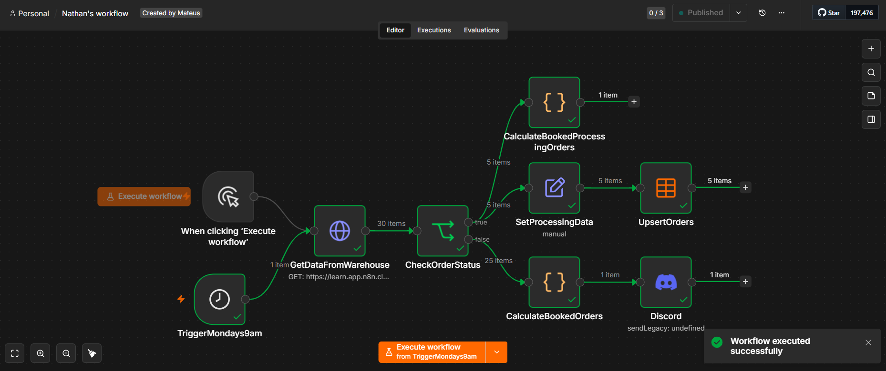
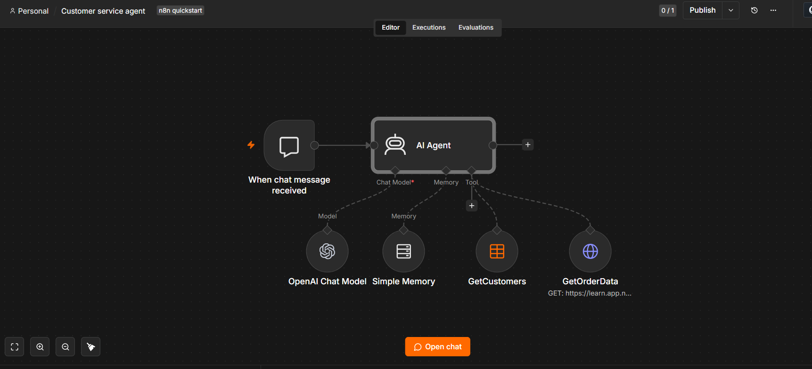
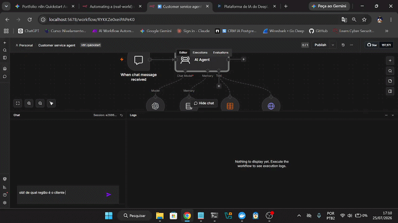
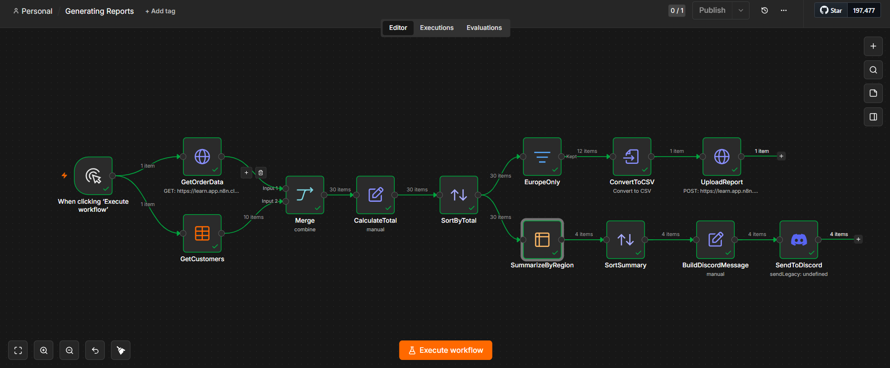
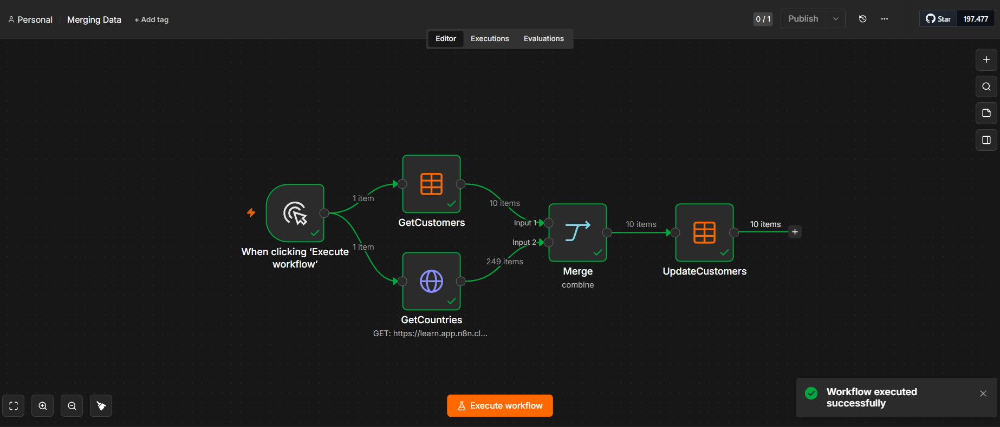
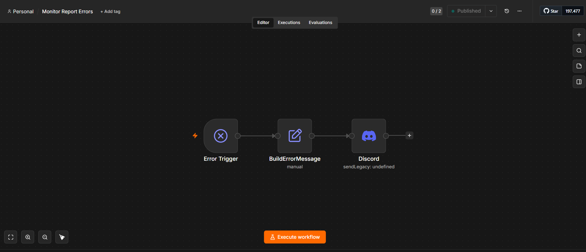

# 🚀 Automação de Relatórios Empresariais e Agente de IA com n8n

Este projeto foi desenvolvido para resolver problemas reais de rotina operacional em uma empresa: eliminação de relatórios manuais de vendas, unificação de dados dispersos e criação de um assistente virtual inteligente para consulta de informações em tempo real.

---

## 📌 O Problema

A equipe de análise de dados precisava lidar semanalmente com processos manuais, demorados e sujeitos a erros:
1. **Consolidação Manual:** Copiar e calcular dados de vendas vindos de um sistema antigo (Legacy Data Warehouse).
2. **Relatórios Dispersos:** Dados de clientes e regiões ficavam em fontes separadas e formatos diferentes.
3. **Lentidão no Suporte:** Consultas simples sobre status de clientes e pedidos exigiam buscar manualmente nos bancos de dados.

---

## 🛠️ Solução e Fluxos Desenvolvidos

### 1. Relatório Semanal Automático de Vendas
* **Arquivo do Fluxo:** [`FluxoSemanal.json`](./FluxoSemanal.json)
* **Agendamento:** Executado automaticamente toda segunda-feira às 9h.
* **Processamento:** Extrai os pedidos via API REST e separa o status entre *Processando* e *Confirmado*.
* **Entrega:** Calcula o faturamento total e envia o resumo consolidado diretamente no **Discord** da equipe.

---

### 2. Agente de Atendimento Inteligente com IA
* **Arquivo do Fluxo:** [`AgenteDeConsulta.json`](./AgenteDeConsulta.json)
* **Assistente com LLM:** Integrado com o modelo de IA da **OpenAI**.
* **Memória de Contexto:** Mantém o histórico da conversa para responder dúvidas de forma natural.
* **Ferramentas de Consulta (Tools):** O agente acessa dados de clientes e pedidos em tempo real via API para responder perguntas como *"Qual a região do cliente ID 10?"*.

---

### 3. Unificação de Dados e Relatórios Avançados (`Generating Reports` & `Merging Data`)
* **Arquivos do Fluxo:** [`GeneratingReports.json`](./GeneratingReports.json) e [`MergingData.json`](./MergingData.json)
* **ETL & Merge:** Junta dados de clientes, países e vendas vindos de diferentes fontes.
* **Exportação:** Ordena as vendas por região, gera um arquivo **CSV** atualizado e faz o upload automático.

---

### 4. Monitoramento e Tratamento de Erros (`Monitor Report Errors`)
* **Arquivo do Fluxo:** [`MonitorReportErrors.json`](./MonitorReportErrors.json)
* **Gestão de Falhas:** Captura automática de qualquer erro nos fluxos (`Error Trigger`).
* **Notificação Técnica:** Envia um alerta detalhado no Discord para que a equipe corrija a falha rapidamente sem perder dados.

---

## 🧰 Tecnologias e Ferramentas

* **Orquestrador de Automação:** n8n
* **Inteligência Artificial:** OpenAI API (LLM, AI Agent, Memory e Tools)
* **Comunicação & Protocolos:** APIs REST, HTTP Requests e Webhooks
* **Notificações:** Discord API
* **Manipulação de Dados:** JavaScript (Code Nodes), JSON Parsing e geração de CSV

---

## 💡 Impacto da Solução

* **Zero erros humanos** na digitação ou cálculo de relatórios financeiros.
* **Economia de horas semanais** da equipe comercial e de análise de dados.
* **Respostas instantâneas** sobre dados de clientes através do Agente de IA.
